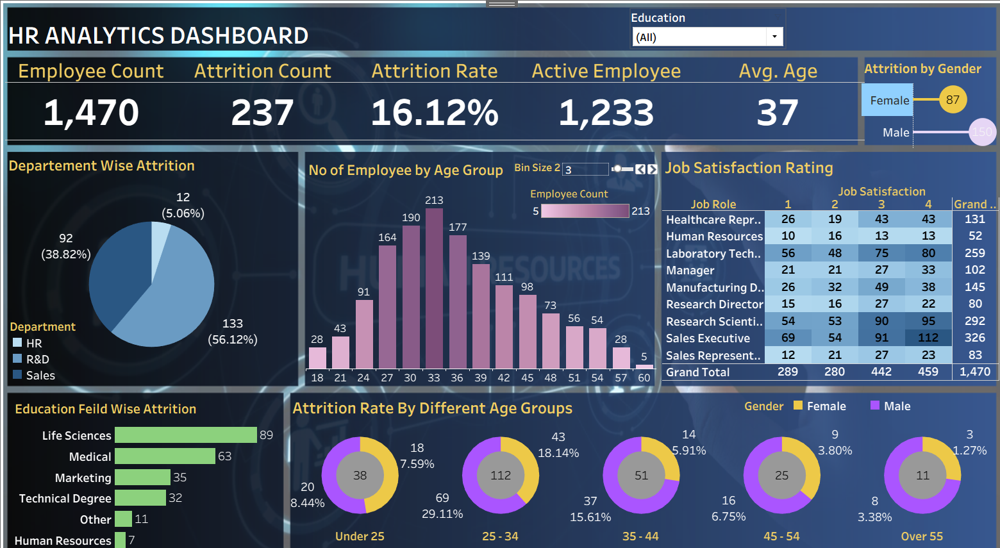

# HR-Analytics-Tableau-Dashboard
# HR Analytics Dashboard

## Project Overview

This project presents an interactive **HR Analytics Dashboard** developed using **Tableau**. The dashboard analyzes employee data to identify patterns and trends related to employee attrition, demographics, job satisfaction, education, and age groups.

The objective of this project is to provide meaningful insights into workforce trends and factors associated with employee attrition.

## Dashboard Preview

## Key Metrics

| Metric | Value |
|--------|------:|
| Employee Count | 1,470 |
| Attrition Count | 237 |
| Attrition Rate | 16.12% |
| Active Employees | 1,233 |
| Average Age | 37 |

## Dashboard Analysis

The dashboard provides insights into the following areas:

### Department-Wise Attrition

Analyzes employee attrition across different departments:

- Human Resources
- Research & Development
- Sales

### Attrition by Gender

Compares employee attrition across male and female employees.

### Employee Distribution by Age Group

Analyzes the number of employees across different age groups to understand workforce demographics.

### Job Satisfaction Rating

Examines job satisfaction ratings across different job roles.

### Education Field-Wise Attrition

Analyzes employee attrition based on education fields, including:

- Life Sciences
- Medical
- Marketing
- Technical Degree
- Human Resources
- Other

### Attrition Rate by Age Group

Compares attrition across the following age groups:

- Under 25
- 25–34
- 35–44
- 45–54
- Over 55
  
## Key Insights

- The overall employee attrition rate is **16.12%**.
- A total of **237 employees** have left the organization.
- The dashboard provides department-wise analysis of employee attrition.
- Employee attrition varies across different age groups.
- Job satisfaction levels differ across job roles.
- Education background and demographic factors provide additional insights into employee attrition.

## Tools and Technologies Used

- Tableau
- Microsoft Excel / CSV
- Data Analysis
- Data Visualization

## Project Structure

HR-Analytics-Tableau-Dashboard/
│
├── README.md
│
├── dashboard/
│   └── HR_Analytics_Dashboard.twbx
│
├── data/
│   └── HR_Analytics_Data.csv
│
└── images/
    └── HR_Analytics_Dashboard.png

## Author 
Nitika Nema 
